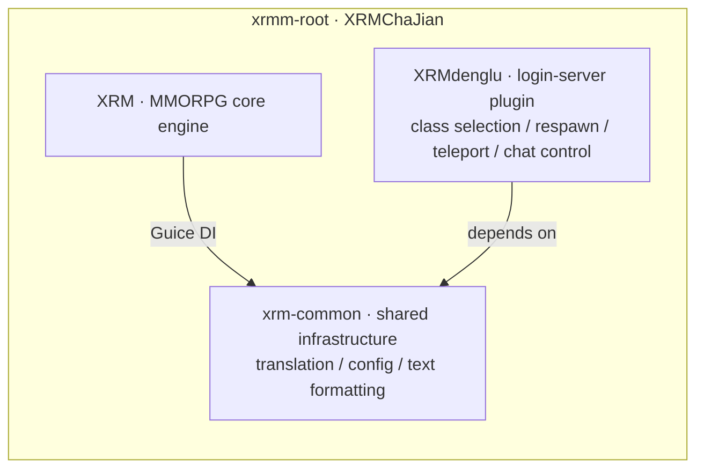

# XRMChaJian · 玄锐暮插件

> The Minecraft MMORPG plugin suite for the "暮澜纪元 (Mulan Era)" server — skills / attributes / talents / quests / instruments / flight / parties, a domain-driven complete MMO gameplay engine, plus a login-server plugin and shared infrastructure. Every module is thoroughly testable.

[](https://github.com/XuanRuiMu/XRMChaJian/stargazers)
[](https://github.com/XuanRuiMu/XRMChaJian/forks)
[](LICENSE)
[](https://github.com/XuanRuiMu/XRMChaJian/commits/main)
[](https://github.com/XuanRuiMu/XRMChaJian/issues)
[](https://github.com/XuanRuiMu/XRMChaJian)
[](https://purpurmc.org/)
[](https://www.oracle.com/java/)
[](https://github.com/XuanRuiMu/XRMChaJian)

> 🌐 [中文](README.md) ｜ English

---

## What is this?

**XRMChaJian (玄锐暮插件)** is the full plugin codebase of "**暮澜纪元**", a Chinese-built MMORPG Minecraft server. It is not a "toy plugin" — it's a **domain-driven** MMO gameplay engine:



**Core design principle: the domain layer has zero Bukkit API dependencies.** All business logic lives in pure Java domain models + service interfaces; the infrastructure layer assembles them via Guice and adapts to Minecraft. The whole engine can be **unit-tested directly** — no "deploy and pray".

---

## XRM — Core gameplay engine

### Domain models (`领域层/`)

| Sub-domain | Content |
| --- | --- |
| ⚔️ Combat | Damage pipeline (multi-stage handlers), damage context, combat state, role types |
| 🎯 Skills | Skill definitions / context, parameter registry / reader, key binds, cast types |
| ✨ Effects | Effect definitions / instances / handlers (stackable, schedulable) |
| 📊 Attributes | Attribute registry, modifiers, derived-attribute computation, snapshots |
| 🌟 Talents | Talent graph / nodes / choices / types (tree-like progression) |
| 📜 Quests | Quest definitions / categories / objectives / progress / rewards |
| 🎵 Instruments | A complete music system: pitch-block mapping, glissando/vibrato, pitch-wheel modulation, chord presets, velocity tiers, sustain, quantization, piano-roll editor, MIDI / NBS import-export |
| 🦅 Flight | Flight state / config (mount-style flying gameplay) |
| 👥 Parties | Party / party-operation results |
| 👤 Players | Player session / snapshot / position |
| 💧 Resources | Resource types / definitions (HP, mana, derived resources) |

### Business & presentation layers

- **Business layer**: skill registration / casting / cooldowns, effect scheduling / registration, talent management, attribute computation, parties, instruments, quest management, target selection, damage calculation, lifesteal, aggro, flight, resource changes, GCD display… interface + implementation separated for easy swapping;
- **Presentation layer**: command handlers (skills / attributes / talents / quests / parties / instruments / flight / HP-scale / combat log / main menu / admin), event listeners (skill keys, equipment swap, movement interrupt, effect lifecycle, reflect, magma immunity, enderman / piglin / spider control, etc.), scoreboards, BossBar;
- **Infrastructure layer**: in-memory implementations (test-friendly), YAML config / translation loaders, Bukkit adapters, DB connection pool (HikariCP + MySQL), MIDI / NBS / mod input channels, NoteBlockAPI adapter, resource-pack manager.

---

## XRMdenglu — Login-server plugin

The login server is a separate plugin covering everything between player entry and entering the game:

- 🎭 **Class-selection GUI**: class (role type / world dimension) picker with class-description color rules;
- 📍 **Respawn management**: login/respawn config, respawn event handling;
- 🌀 **Teleport management**: portal regions (auto-sorted coordinates), portal listeners, teleport commands;
- 🛡️ **Login control**: chat blocking (muted until in-game), forced adventure mode, player data / DB connection management;
- 🌐 **Translated output**: all player-visible text goes through translation files.

---

## xrm-common — Shared infrastructure

- 🌐 **Translation service**: YAML translation loader, language-code aliases (zh / en), server-side init;
- 📝 **Text domain**: keyword parser (skill names / keyword coloring), text formatter;
- 🧩 **Config**: type-safe YAML config loader.

---

## Engineering highlights

- **Four-layer DDD**: `领域层 / 业务层 / 表现层 / 基础设施层` strictly separated, domain models with zero Bukkit dependency;
- **Guice DI**: modules assembled via Guice; interfaces can swap to in-memory implementations freely;
- **Translation-file driven**: every player-visible string comes from `翻译/*.yml` — no hardcoded text (see `sync_manifest.py`);
- **Zero hardcoding**: numbers / config / messages all externalized to YAML;
- **Test ceiling**: JUnit 5 + Mockito, per-module test suites covering domain logic through full-flow text output (100+ test classes);
- **Strict compilation**: `-Xlint:all -Werror` treats warnings as errors; `-Xlint:-deprecation` blocks deprecated API usage.

---

## Requirements

| Dependency | Version |
| --- | --- |
| Minecraft server | Purpur / Paper (compileOnly `purpur-api:26.2.build.+`) |
| Java | 25 (Gradle toolchain) |
| MySQL | 8.x (HikariCP pool) |
| Build | Gradle 9.x (Kotlin DSL) |

Optional soft dependencies: ProtocolLib, EliteMobs, Citizens, NoteBlockAPI (loaded at runtime when present).

---

## Build & test

```bash
# Build all modules and deploy into the server's plugins dir
./gradlew build

# Run tests (XRM / XRMdenglu run tests only when explicitly enabled)
./gradlew -PrunTests=true test

# Run a single test class (ConsoleLauncher)
./gradlew -PrunTests=true runTests -PtestClass=com.example.SomeTest

# Publish xrm-common to local Maven (for XRM/XRMdenglu)
./gradlew -p xrm-common publishToMavenLocal
```

> Modules use date-based versions (`yyyy.M.d`); `tasks.jar` fat-jars runtime dependencies automatically.

---

## Project structure

```text
XRMChaJian/
├── settings.gradle.kts         # root: includeBuild XRM / XRMdenglu / xrm-common
├── xrm-common/                 # shared: translation / config / text (standalone Maven lib)
├── XRM/                        # MMORPG core engine
│   └── src/main/java/mljy/
│       ├── 领域层/             # combat · skills · effects · attributes · talents · quests · instruments · flight · parties…
│       ├── 业务层/             # service interfaces + impls (casting · effect scheduling · damage calc…)
│       ├── 表现层/             # commands · listeners · scoreboard · BossBar
│       └── 基础设施层/         # in-memory · YAML · database · Bukkit adapters · instrument file formats
├── XRMdenglu/                  # login-server plugin (class GUI · respawn · teleport · control)
│   └── src/main/java/暮澜纪元/
│       ├── 职业/ 配置/ 菜单/ 命令/ 监听器/ 数据/
└── 开发需求文档/               # per-module test reports & dev docs
```

---

## License

[MIT](LICENSE) — open-source showcase repository. **Made with ❤️ — building real MMO plugins with real engineering.**